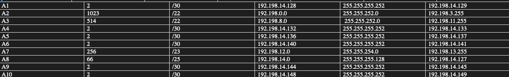
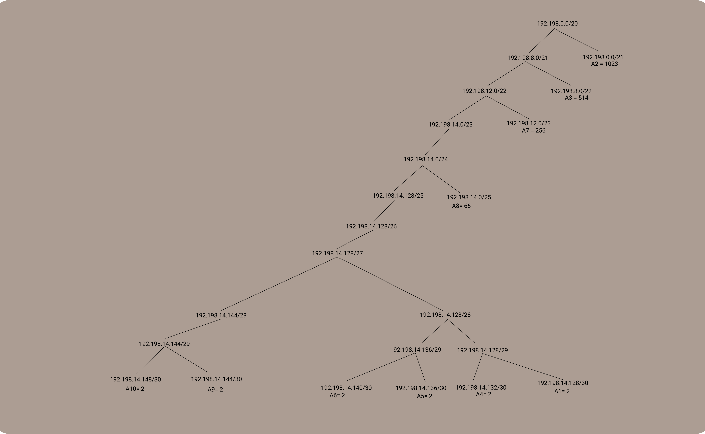
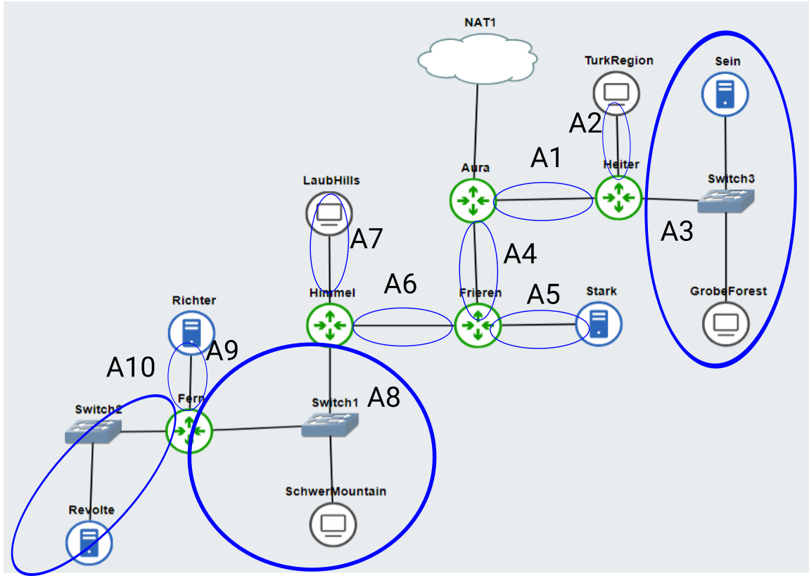

# Jarkom-Modul-5-D14-2023

## Author
- Darren Prasetya (5025211162)
- Mohammad Kamal (5025211180)


# Subnet Labelling


<br>

# VLSM Tree

<br>

# Topology

<br>


# Routing 

- Aura ❄️

```

route add -net 192.198.0.0 netmask 255.255.252.0 gw 192.198.14.130
route add -net 192.198.8.0 netmask 255.255.252.0 gw 192.198.14.130
route add -net 192.198.14.136 netmask 255.255.255.252 gw 192.198.14.134
route add -net 192.198.14.140 netmask 255.255.255.252 gw 192.198.14.134
route add -net 192.198.12.0 netmask 255.255.254.0 gw 192.198.14.134
route add -net 192.198.14.0 netmask 255.255.255.128 gw 192.198.14.134
route add -net 192.198.14.144 netmask 255.255.255.252 gw 192.198.14.134
route add -net 192.198.14.148 netmask 255.255.255.252 gw 192.198.14.134
```


- Frieren 
```
route add -net 192.198.12.0 netmask 255.255.254.0 gw 192.198.14.142
route add -net 192.198.14.0 netmask 255.255.255.252 gw 192.198.14.142
route add -net 192.198.14.144 netmask 255.255.255.252 gw 192.198.14.142
route add -net 192.198.14.148 netmask 255.255.255.252 gw 192.198.14.142
```


- Himmel 
```

route add -net 192.198.14.144 netmask 255.255.255.252 gw 192.198.14.2
route add -net 192.198.14.148 netmask 255.255.255.252 gw 192.198.14.2

```


# Konfig 

Pada non-dhcp 
```
echo 'nameserver 192.168.122.1' > /etc/resolv.conf
```


- Ritcher  (DNS SERVER)

```
apt-get update
apt-get install bind9 -y

echo '
options {
        directory "/var/cache/bind";
        forwarders {
                192.168.122.1;
        };
        allow-query{any;};
        auth-nxdomain no;
        listen-on-v6 { any; };
};
' > /etc/bind/named.conf.options

# rndc reload
service bind9 restart

```

- Revolte (DHCP Server)
```
apt-get update
apt-get install isc-dhcp-server -y

echo 'INTERFACES="eth0"' > /etc/default/isc-dhcp-server


echo '
subnet 192.198.14.148 netmask 255.255.255.252 {   
}
' > /etc/dhcp/dhcpd.conf

#SchwerMountain
echo '
subnet 192.198.14.0 netmask 255.255.255.128 {
    range 192.198.14.2 192.198.14.127;
    option routers 192.198.14.1;
    option broadcast-address 192.198.14.127;
    option domain-name-servers 192.198.14.146;
    default-lease-time 300;
    max-lease-time 6900;
}
' >> /etc/dhcp/dhcpd.conf

#TurkRegion
echo '
subnet 192.198.0.0 netmask 255.255.252.0 {
    range 192.198.0.2 192.198.3.254;
    option routers 192.198.0.1;
    option broadcast-address 192.198.3.255;
    option domain-name-servers 192.198.14.146;
    default-lease-time 300;
    max-lease-time 6900;
}
' >> /etc/dhcp/dhcpd.conf

#LaubHills
echo '
subnet 192.198.12.0 netmask 255.255.254.0 {
    range 192.198.12.2 192.198.13.254;
    option routers 192.198.12.1;
    option broadcast-address 192.198.13.255;
    option domain-name-servers 192.198.14.146;
    default-lease-time 300;
    max-lease-time 6900;
}
' >> /etc/dhcp/dhcpd.conf

#GroberForest
echo '
subnet 192.198.8.0 netmask 255.255.252.0 {
    range 192.198.8.2 192.198.11.254;
    option routers 192.198.8.1;
    option broadcast-address 192.198.11.255;
    option domain-name-servers 192.198.14.146;
    default-lease-time 300;
    max-lease-time 6900;
}
' >> /etc/dhcp/dhcpd.conf

# Web server  stark 

echo '
subnet 192.198.14.136 netmask 255.255.255.252 {
}
' >> /etc/dhcp/dhcpd.conf

# gw ada bug pas echo stark hati2. Solusinya copy netmask255 gak pake spasi

service isc-dhcp-server restart
```


-  Heiter, Frieren, Himmel, Fern (DHCP Relay)
```
apt-get update
apt-get install isc-dhcp-relay -y


echo '
SERVERS="192.198.14.150"
INTERFACES="eth0 eth1 eth2 eth3"
OPTIONS=""
' > /etc/default/isc-dhcp-relay

echo '
net.ipv4.ip_forward=1
' > /etc/sysctl.conf

service isc-dhcp-relay restart
```


# Nomor 1

**Agar topologi yang kalian buat dapat mengakses keluar, kalian diminta untuk mengkonfigurasi Aura menggunakan iptables, tetapi tidak ingin menggunakan MASQUERADE.**

Pada Aura
```
iptables -t nat -A POSTROUTING -o eth0 -j SNAT -s 192.198.0.0/19 --to-source 192.168.122.2
```

Lalu pada semua node non-dhcp termasuk aura
```
echo 'nameserver 192.168.122.1' > /etc/resolv.conf
```

# Nomor 2 

**Kalian diminta untuk melakukan drop semua TCP dan UDP kecuali port 8080 pada TCP.

Pada aura : 

```
# Drop semua paket TCP kecuali port 8080
iptables -A FORWARD -i eth0 -p tcp --dport 8080 -j ACCEPT 
iptables -A FORWARD -i eth0 -p tcp -j DROP 
# Drop semua paket UDP 
iptables -A FORWARD -i eth0 -p udp -j DROP
```


# Nomor 3

**Kepala Suku North Area meminta kalian untuk membatasi DHCP dan DNS Server hanya dapat dilakukan ping oleh maksimal 3 device secara bersamaan, selebihnya akan di drop.**

Pada Revolte dan Ritcher  : 


```
iptables -A INPUT -p udp --dport 67 -m connlimit --connlimit-above 3 --connlimit-mask 0 -j DROP

iptables -A INPUT -p udp --dport 53 -m connlimit --connlimit-above 3 --connlimit-mask 0 -j DROP
```


